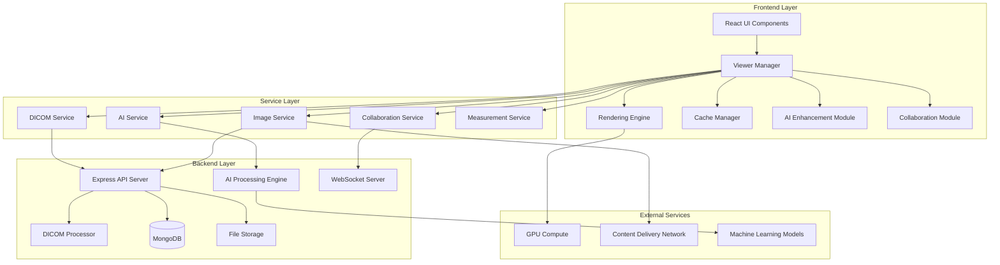

# Design Document

## Overview

The enhanced multi-slice DICOM viewer will be redesigned as a modular, high-performance medical imaging platform that combines reliability fixes with cutting-edge features. The architecture will leverage modern web technologies, GPU acceleration, AI integration, and real-time collaboration capabilities to deliver a professional-grade medical imaging solution.

## Architecture

### High-Level Architecture



### Core Components Architecture

The viewer will be built using a modular architecture with the following key components:

1. **Viewer Manager**: Central orchestrator managing viewer state, mode switching, and component coordination
2. **Rendering Engine**: High-performance canvas-based rendering with WebGL acceleration
3. **Cache Manager**: Intelligent image caching with predictive prefetching
4. **AI Enhancement Module**: Real-time image processing and analysis
5. **Collaboration Module**: Real-time multi-user interaction and synchronization

## Components and Interfaces

### 1. Enhanced Viewer Manager

```typescript
interface ViewerManager {
  // Core viewer management
  initializeViewer(config: ViewerConfig): Promise<void>
  switchMode(mode: ViewerMode): Promise<void>
  loadStudy(study: Study): Promise<void>
  
  // State management
  getViewerState(): ViewerState
  updateViewerState(updates: Partial<ViewerState>): void
  
  // Error handling and recovery
  handleError(error: ViewerError): void
  attemptRecovery(): Promise<boolean>
  
  // Performance monitoring
  getPerformanceMetrics(): PerformanceMetrics
}

interface ViewerConfig {
  mode: ViewerMode
  enableAI: boolean
  enableCollaboration: boolean
  cacheSize: number
  gpuAcceleration: boolean
  debugMode: boolean
}

interface ViewerState {
  currentSlice: number
  totalSlices: number
  zoom: number
  rotation: number
  brightness: number
  contrast: number
  pan: Point2D
  measurements: Measurement[]
  annotations: Annotation[]
  aiEnhancements: AIEnhancement[]
  collaborationSession?: CollaborationSession
}
```

### 2. Advanced Rendering Engine

```typescript
interface RenderingEngine {
  // Core rendering
  render(image: ImageData, viewport: Viewport): void
  renderSlice(sliceIndex: number): Promise<void>
  
  // 3D rendering
  render3D(volumeData: VolumeData, settings: Render3DSettings): void
  renderMPR(planes: MPRPlanes): void
  
  // GPU acceleration
  enableGPUAcceleration(): boolean
  getGPUCapabilities(): GPUCapabilities
  
  // Performance optimization
  setRenderQuality(quality: RenderQuality): void
  enableAdaptiveRendering(enabled: boolean): void
}

interface Viewport {
  width: number
  height: number
  scale: number
  translation: Point2D
  rotation: number
  windowWidth: number
  windowCenter: number
}

interface Render3DSettings {
  renderMode: '3d' | 'mip' | 'surface' | 'volume'
  opacity: number
  threshold: number
  colorMap: string
  clippingPlanes: ClippingPlane[]
}
```

### 3. Intelligent Cache Manager

```typescript
interface CacheManager {
  // Cache operations
  cacheImage(key: string, image: ImageData): Promise<void>
  getCachedImage(key: string): Promise<ImageData | null>
  
  // Predictive caching
  prefetchSlices(currentSlice: number, direction: 'forward' | 'backward'): void
  prefetchStudy(studyId: string): Promise<void>
  
  // Memory management
  optimizeMemoryUsage(): void
  getCacheStatistics(): CacheStatistics
  
  // Cache strategies
  setCacheStrategy(strategy: CacheStrategy): void
}

interface CacheStrategy {
  maxMemoryUsage: number
  prefetchCount: number
  evictionPolicy: 'lru' | 'lfu' | 'adaptive'
  compressionEnabled: boolean
}
```

### 4. AI Enhancement Module

```typescript
interface AIEnhancementModule {
  // Image enhancement
  enhanceImage(image: ImageData, enhancement: AIEnhancementType): Promise<ImageData>
  detectAbnormalities(image: ImageData): Promise<AbnormalityDetection[]>
  
  // Real-time processing
  enableRealTimeEnhancement(enabled: boolean): void
  setEnhancementSettings(settings: AISettings): void
  
  // Model management
  loadModel(modelType: AIModelType): Promise<void>
  getAvailableModels(): AIModelInfo[]
}

interface AbnormalityDetection {
  region: BoundingBox
  confidence: number
  type: string
  description: string
  severity: 'low' | 'medium' | 'high'
}

interface AISettings {
  noiseReduction: number
  contrastEnhancement: number
  edgeEnhancement: number
  abnormalityDetection: boolean
  confidenceThreshold: number
}
```

### 5. Collaboration Module

```typescript
interface CollaborationModule {
  // Session management
  createSession(studyId: string): Promise<CollaborationSession>
  joinSession(sessionId: string): Promise<void>
  leaveSession(): void
  
  // Real-time synchronization
  syncViewport(viewport: Viewport): void
  syncAnnotations(annotations: Annotation[]): void
  syncCursor(position: Point2D): void
  
  // Communication
  sendMessage(message: ChatMessage): void
  startVoiceChat(): Promise<void>
  startVideoCall(): Promise<void>
}

interface CollaborationSession {
  id: string
  studyId: string
  participants: Participant[]
  createdAt: Date
  isActive: boolean
}
```

## Data Models

### Enhanced Study Model

```typescript
interface Study {
  // Core DICOM metadata
  study_uid: string
  patient_id: string
  study_date: string
  modality: string
  study_description: string
  
  // Image data
  image_urls: string[]
  total_slices: number
  is_multi_slice: boolean
  
  // Processing status
  processing_status: 'pending' | 'processing' | 'completed' | 'failed'
  ai_processing_status: 'pending' | 'processing' | 'completed' | 'failed'
  
  // Enhanced metadata
  dicom_metadata: DICOMMetadata
  image_metadata: ImageMetadata
  ai_analysis?: AIAnalysisResult
  
  // Performance data
  cache_status: CacheStatus
  load_performance: LoadPerformance
}

interface ImageMetadata {
  dimensions: {
    width: number
    height: number
    depth?: number
  }
  spacing: {
    x: number
    y: number
    z?: number
  }
  orientation: string
  pixel_data_type: string
  bits_allocated: number
  window_center: number
  window_width: number
}

interface AIAnalysisResult {
  abnormalities: AbnormalityDetection[]
  image_quality_score: number
  enhancement_suggestions: string[]
  processing_time: number
  model_version: string
}
```

### Measurement and Annotation Models

```typescript
interface Measurement {
  id: string
  type: 'distance' | 'area' | 'angle' | 'volume'
  points: Point2D[]
  value: number
  unit: string
  slice_index: number
  created_by: string
  created_at: Date
  metadata?: MeasurementMetadata
}

interface Annotation {
  id: string
  type: 'text' | 'arrow' | 'circle' | 'rectangle' | 'freehand'
  position: Point2D
  content: string
  style: AnnotationStyle
  slice_index: number
  created_by: string
  created_at: Date
}

interface AnnotationStyle {
  color: string
  fontSize: number
  lineWidth: number
  opacity: number
}
```

## Error Handling

### Comprehensive Error Management System

```typescript
interface ErrorHandler {
  // Error classification
  classifyError(error: Error): ErrorType
  
  // Recovery strategies
  attemptRecovery(error: ViewerError): Promise<RecoveryResult>
  
  // Fallback mechanisms
  enableFallbackMode(): void
  switchToCompatibilityMode(): void
  
  // User communication
  displayUserFriendlyError(error: ViewerError): void
  provideRecoveryOptions(error: ViewerError): RecoveryOption[]
}

enum ErrorType {
  NETWORK_ERROR = 'network',
  DICOM_PARSING_ERROR = 'dicom_parsing',
  RENDERING_ERROR = 'rendering',
  GPU_ERROR = 'gpu',
  MEMORY_ERROR = 'memory',
  AI_PROCESSING_ERROR = 'ai_processing',
  COLLABORATION_ERROR = 'collaboration'
}

interface RecoveryStrategy {
  type: ErrorType
  actions: RecoveryAction[]
  fallbackMode?: ViewerMode
  retryAttempts: number
  timeout: number
}
```

### Error Recovery Mechanisms

1. **Automatic Fallbacks**: When advanced features fail, automatically fall back to basic functionality
2. **Progressive Enhancement**: Start with basic viewer and progressively enable advanced features
3. **Graceful Degradation**: Maintain core functionality even when optional features fail
4. **User-Guided Recovery**: Provide clear options for users to resolve issues

## Testing Strategy

### Multi-Layer Testing Approach

#### 1. Unit Testing
- Individual component testing with Jest and React Testing Library
- Mock DICOM data for consistent testing
- AI module testing with synthetic medical images
- Performance benchmarking for critical functions

#### 2. Integration Testing
- End-to-end viewer workflows
- DICOM processing pipeline testing
- Real-time collaboration testing
- Cross-browser compatibility testing

#### 3. Performance Testing
- Large dataset handling (1000+ slices)
- Memory usage optimization
- GPU acceleration validation
- Network latency simulation

#### 4. Medical Accuracy Testing
- DICOM compliance validation
- Measurement accuracy verification
- AI enhancement quality assessment
- Collaboration synchronization accuracy

#### 5. User Experience Testing
- Radiologist workflow simulation
- Accessibility compliance (WCAG 2.1)
- Mobile device compatibility
- Error scenario handling

### Testing Infrastructure

```typescript
interface TestingFramework {
  // Test data management
  generateMockDICOM(config: MockDICOMConfig): DICOMFile
  createTestStudy(sliceCount: number): Study
  
  // Performance testing
  measureRenderingPerformance(): PerformanceMetrics
  simulateNetworkConditions(conditions: NetworkConditions): void
  
  // AI testing
  validateAIEnhancements(original: ImageData, enhanced: ImageData): ValidationResult
  testAbnormalityDetection(testCases: TestCase[]): DetectionResults
  
  // Collaboration testing
  simulateMultiUserSession(userCount: number): CollaborationTest
}
```

## Performance Optimization

### Multi-Level Optimization Strategy

#### 1. Rendering Optimization
- WebGL-based rendering for GPU acceleration
- Adaptive quality rendering based on viewport size
- Efficient texture management and reuse
- Progressive image loading with quality levels

#### 2. Memory Management
- Intelligent cache eviction policies
- Image compression for non-active slices
- Memory pool management for large datasets
- Garbage collection optimization

#### 3. Network Optimization
- Predictive prefetching based on user behavior
- Image streaming with progressive enhancement
- CDN integration for global performance
- Compression and optimization for different network conditions

#### 4. AI Processing Optimization
- GPU-accelerated AI inference
- Model quantization for faster processing
- Batch processing for multiple enhancements
- Edge computing integration for reduced latency

### Performance Monitoring

```typescript
interface PerformanceMonitor {
  // Real-time metrics
  trackRenderingPerformance(): RenderingMetrics
  monitorMemoryUsage(): MemoryMetrics
  measureNetworkPerformance(): NetworkMetrics
  
  // User experience metrics
  trackUserInteractions(): InteractionMetrics
  measureResponseTimes(): ResponseTimeMetrics
  
  // System health
  getSystemHealth(): SystemHealthStatus
  generatePerformanceReport(): PerformanceReport
}
```

This comprehensive design provides a robust foundation for building a state-of-the-art medical imaging viewer that not only fixes current issues but elevates the entire platform to professional standards with advanced AI capabilities, real-time collaboration, and optimal performance.