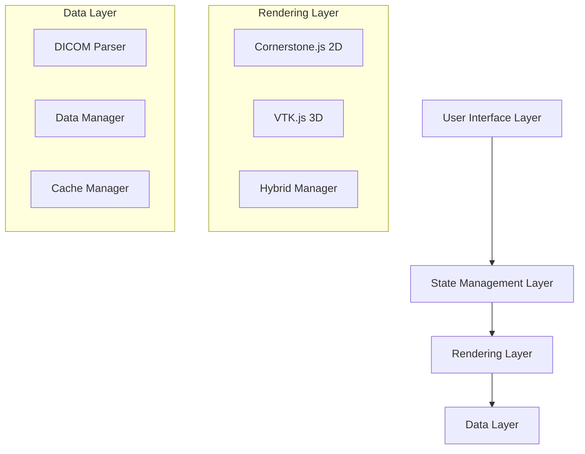

# VTK.js 3D Integration Design Document

## Overview

This design document outlines the integration of VTK.js into the existing DICOM viewer application to provide professional-grade 3D visualization capabilities. The architecture maintains backward compatibility with the current Cornerstone.js implementation while adding powerful 3D rendering, multi-planar reconstruction (MPR), and advanced visualization tools.

The design follows a hybrid approach where users can seamlessly switch between 2D slice viewing (Cornerstone.js) and 3D visualization (VTK.js), with shared state management and synchronized interactions.

## Architecture

### High-Level Architecture



### Component Architecture

The integration introduces several new components while extending existing ones:

1. **VTKRenderingEngine** - Core VTK.js wrapper and management
2. **HybridViewManager** - Coordinates between 2D and 3D rendering modes
3. **VTK3DViewer** - Main 3D visualization component
4. **MPRViewer** - Multi-planar reconstruction component
5. **VolumeRenderingControls** - Advanced 3D rendering controls
6. **DICOMVolumeLoader** - Efficient DICOM-to-VTK data pipeline

## Components and Interfaces

### 1. VTKRenderingEngine

**Purpose:** Central management of VTK.js rendering pipeline and resources

**Key Responsibilities:**
- Initialize and manage VTK.js render windows
- Handle WebGL context creation and error recovery
- Manage memory allocation and cleanup
- Coordinate multiple VTK views (volume, MPR, surface)

**Interface:**
```typescript
interface VTKRenderingEngine {
  initialize(container: HTMLElement): Promise<boolean>;
  createVolumeRenderer(data: VolumeData): VolumeRenderer;
  createMPRRenderer(data: VolumeData): MPRRenderer;
  dispose(): void;
  getCapabilities(): WebGLCapabilities;
}
```#
## 2. HybridViewManager

**Purpose:** Seamless coordination between Cornerstone 2D and VTK 3D rendering modes

**Key Responsibilities:**
- Manage view mode transitions (2D ↔ 3D)
- Synchronize camera positions and slice locations
- Preserve window/level settings across modes
- Handle shared annotations and measurements

**Interface:**
```typescript
interface HybridViewManager {
  setRenderingMode(mode: '2d' | '3d' | 'hybrid'): void;
  syncSlicePosition(position: SlicePosition): void;
  syncWindowLevel(wl: WindowLevel): void;
  syncAnnotations(annotations: Annotation[]): void;
}
```

### 3. VTK3DViewer Component

**Purpose:** Main React component for 3D volume visualization

**Key Features:**
- Volume rendering with transfer functions
- Real-time interaction (rotation, zoom, pan)
- Clipping planes and advanced visualization
- Integration with existing Navigation3DControls

**Props Interface:**
```typescript
interface VTK3DViewerProps {
  studyData: DICOMStudy;
  renderingMode: '3d' | 'mpr' | 'volume' | 'surface';
  navigation3DState: Navigation3DState;
  onStateChange: (state: Navigation3DState) => void;
  windowLevel: WindowLevel;
  onError: (error: VTKError) => void;
}
```

### 4. DICOMVolumeLoader

**Purpose:** Efficient conversion of DICOM pixel data to VTK volume objects

**Key Responsibilities:**
- Parse DICOM metadata for spatial information
- Convert pixel arrays to VTK ImageData
- Handle different pixel formats and bit depths
- Implement progressive loading for large datasets

**Interface:**
```typescript
interface DICOMVolumeLoader {
  loadVolume(series: DICOMSeries): Promise<VTKVolume>;
  loadProgressively(series: DICOMSeries, callback: ProgressCallback): Promise<VTKVolume>;
  extractMetadata(series: DICOMSeries): VolumeMetadata;
}
```

## Data Models

### VTK Volume Data Structure

```typescript
interface VTKVolume {
  imageData: vtkImageData;
  metadata: VolumeMetadata;
  transferFunctions: {
    opacity: vtkPiecewiseFunction;
    color: vtkColorTransferFunction;
  };
  bounds: number[]; // [xmin, xmax, ymin, ymax, zmin, zmax]
  spacing: number[]; // [x, y, z] pixel spacing in mm
  origin: number[];  // [x, y, z] origin coordinates
}

interface VolumeMetadata {
  patientPosition: string;
  imageOrientation: number[];
  pixelSpacing: number[];
  sliceThickness: number;
  numberOfFrames: number;
  windowCenter: number;
  windowWidth: number;
}
```

### Enhanced Navigation3D State

```typescript
interface Enhanced3DState extends Navigation3DState {
  // VTK-specific properties
  transferFunctions: {
    opacityPoints: OpacityPoint[];
    colorPoints: ColorPoint[];
  };
  clippingPlanes: ClippingPlane[];
  renderingQuality: 'low' | 'medium' | 'high';
  enableGPUAcceleration: boolean;
  
  // MPR-specific properties
  mprSliceThickness: number;
  crosshairVisibility: boolean;
  sliceSynchronization: boolean;
}
```

## Error Handling

### Error Types and Recovery Strategies

1. **WebGL Initialization Errors**
   - Detection: Check WebGL context creation
   - Recovery: Fallback to Cornerstone 2D mode
   - User Feedback: Clear error message with system requirements

2. **Memory Allocation Errors**
   - Detection: Monitor GPU memory usage
   - Recovery: Reduce texture resolution, enable compression
   - User Feedback: Performance warning with optimization suggestions

3. **DICOM Loading Errors**
   - Detection: Validate DICOM data structure
   - Recovery: Attempt alternative loading methods
   - User Feedback: Specific error details with troubleshooting steps

4. **Rendering Pipeline Errors**
   - Detection: VTK.js error callbacks
   - Recovery: Reset rendering pipeline, clear cache
   - User Feedback: Option to report bug with diagnostic information

### Error Handling Implementation

```typescript
class VTKErrorHandler {
  handleWebGLError(error: WebGLError): void {
    // Log error details
    console.error('WebGL Error:', error);
    
    // Notify user and disable 3D features
    this.notificationService.showError(
      'WebGL not supported. 3D features disabled.',
      { action: 'View System Requirements' }
    );
    
    // Fallback to 2D mode
    this.hybridViewManager.setRenderingMode('2d');
  }
  
  handleMemoryError(error: MemoryError): void {
    // Attempt automatic recovery
    this.optimizeMemoryUsage();
    
    // Notify user of performance impact
    this.notificationService.showWarning(
      'Large dataset detected. Reducing quality for better performance.',
      { action: 'Optimize Settings' }
    );
  }
}
```

## Testing Strategy

### Unit Testing

1. **VTK Component Tests**
   - Mock VTK.js dependencies
   - Test component lifecycle and state management
   - Verify error handling and fallback mechanisms

2. **Data Pipeline Tests**
   - Test DICOM-to-VTK conversion accuracy
   - Validate metadata preservation
   - Test memory management and cleanup

3. **Integration Tests**
   - Test 2D/3D mode switching
   - Verify state synchronization
   - Test cross-browser compatibility

### Performance Testing

1. **Memory Usage Tests**
   - Monitor memory allocation patterns
   - Test garbage collection efficiency
   - Validate memory leak prevention

2. **Rendering Performance Tests**
   - Measure frame rates during interaction
   - Test with various dataset sizes
   - Benchmark against performance requirements

3. **Load Testing**
   - Test with multiple concurrent 3D views
   - Validate performance with large datasets (>1GB)
   - Test progressive loading efficiency

### Browser Compatibility Testing

1. **WebGL Capability Detection**
   - Test WebGL 1.0 and 2.0 support
   - Validate extension availability
   - Test fallback mechanisms

2. **Cross-Browser Testing**
   - Chrome, Firefox, Safari, Edge compatibility
   - Mobile browser support
   - High-DPI display handling

## Implementation Phases

### Phase 1: Core VTK Integration (Weeks 1-2)
- Install and configure VTK.js
- Implement basic VTKRenderingEngine
- Create simple volume rendering
- Basic error handling and fallbacks

### Phase 2: Hybrid View Management (Weeks 3-4)
- Implement HybridViewManager
- Enable 2D/3D mode switching
- Synchronize basic state between modes
- Integration with existing Navigation3DControls

### Phase 3: Advanced 3D Features (Weeks 5-6)
- Multi-planar reconstruction (MPR)
- Advanced transfer functions
- Clipping planes and surface rendering
- Performance optimizations

### Phase 4: Polish and Optimization (Weeks 7-8)
- Memory management improvements
- Cross-browser compatibility fixes
- Comprehensive error handling
- Performance tuning and testing